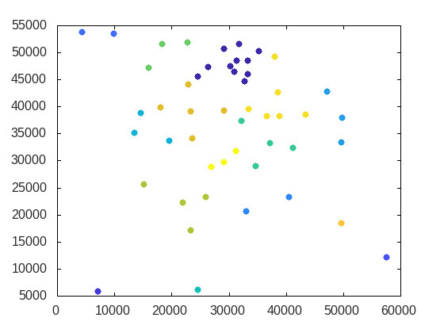

## Object Oriented Programming I FALL SEMESTER PROJECT
-----
### Abstract

The project includes the implementation of the K-Means that is an unsupervised machine learning algorithm.

### Classes

- Clustering is base class. It designed for utilty function (readfile etc.), keeping vector of points and result of clustering.
- Kmeans class is source code of algorithm. It designed for iteration over data, maintain K-means++ centroid initialization algorithm.
- Node class stores data points in vector with format (id,x,y).
- Visualize class designed for Matplot++ visualization library.

-----
### Installation
- First clone repo in your workspace.
- For visualizatin process, git clone https://github.com/alandefreitas/matplotplusplus.git

- **sudo apt install gnuplot** to see plot after program is terminated.

- After clone above repository in workspace, run **cmake .**

- **make** 

- run binary file with run **./program**
-----
### Dependencies
- cmake version 3.14+ installed
- make sure your C++ compiler supports C++17:
-----
### Tested
- ubuntu 20.04
- g++ 9.3.0
- cmake 3.16.0
- gnuplot 5.2 patchlevel 8
-----
### Demo
- Demo file consist of result of algorithm with different parameters.

